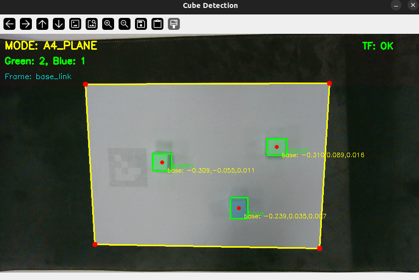

# alicia_d_cube_sort - 立方体分拣模块（2D抓取）

本模块为 Alicia-D 机械臂提供完整的颜色识别和自动分拣功能，可以通过彩色相机检测工作区内的立方体，并按照颜色自动分拣到指定位置。

> [!warning]
> 本模块以 Intel Realsense D405 和 Orbbec Gemini 335 相机为例。如使用其它相机，可能需要修改相关文件。

前置模块： [alicia_d_calibration](../alicia_d_calibration) - 手眼标定

## 📋 模块说明

**alicia_d_cube_sort** 是一个完整的物体分拣解决方案，用于：
- 基于 HSV 颜色空间检测绿色和蓝色立方体
- 利用相机或深度信息估算物体 3D 位置
- 使用 MoveIt 进行运动规划和执行
- 自动执行取放操作和立方体分拣工作流

## 📁 文件结构

```
alicia_d_cube_sort/
├── scripts/
│   ├── cube_detection.py              # 立方体检测节点
│   └── cube_sorting.py                # 分拣控制节点
├── launch/
│   ├── cube_detection.launch.py       # 检测启动文件
│   └── cube_sorting.launch.py         # 分拣启动文件
├── config/
│   └── cube_sorting.yaml              # 配置文件
├── alicia_d_cube_sort/
│   ├── __init__.py                    # Python 包初始化
│   └── utils/                         # 辅助工具模块
├── package.xml                        
├── CMakeLists.txt                     
└── README.md                          
```

## 🚀 快速开始

### 1. 环境准备

在运行标定前，确保需要的环境已经设置：

```bash
# 创建 conda 环境（如果需要）
conda create -n 2d python=3.10 -y
conda activate 2d
conda install pip -y

# 安装依赖
pip install "numpy>=1.24,<2.0" scipy pyyaml opencv-python opencv-contrib-python jinja2 typeguard
```

> [!note]
> 若非明确指定，请尽量确保退出 ``conda`` 再运行程序 ：
> ```bash
> conda deactivate
> ```

### 2. 启动必要的组件

在不同的终端中依次启动：

**终端 1：启动机械臂驱动和 MoveIt**

> ``gripper type`` 根据实际情况修改（50/100mm）
> 
```bash
ros2 launch alicia_d_moveit real_robot.launch.py gripper_type:=50mm
```

**终端 2：启动相机驱动**

若使用 Realsense D405 相机：
```bash
ros2 launch realsense2_camera rs_launch.py \
    enable_infra1:=true \
    enable_infra2:=true \
    infra_rgb:=true \
    pointcloud.enable:=true
```

若使用 Gemini 335 相机：
```bash
ros2 launch orbbec_camera gemini_330_series.launch.py \
    enable_left_ir:=true \
    enable_right_ir:=true \
    enable_point_cloud:=true \
    enable_colored_point_cloud:=true
```

### 3. 运行立方体检测

**终端 3：启动检测节点**

激活 ``conda`` 环境:

```bash
conda activate 2d
```

启动检测节点（默认适配Realsense D405）：

```bash
ros2 launch alicia_d_cube_sort cube_detection.launch.py
```

若使用 Gemini 335 相机，请添加参数：

```bash
ros2 launch alicia_d_cube_sort cube_detection.launch.py \
    camera_topic:=/camera/color/image_raw \
    camera_info_topic:=/camera/color/camera_info
```

<p align="center"></p>

### 4. 运行立方体分拣

**终端 4：启动分拣节点**

退出 ``conda`` 环境：

```
conda deactivate
```

启动分拣节点：

```bash
ros2 launch alicia_d_cube_sort cube_sorting.launch.py
```

分拣节点会自动：
1. 移动机械臂到检测位置（HOME）
2. 等待检测节点发送检测结果
3. 优先拾取绿色立方体，放置到指定位置
4. 然后拾取蓝色立方体，放置到另一个位置
5. 重复上述过程直到所有立方体被分拣


## 📖 主要脚本说明

### cube_detection.py

立方体检测节点，功能包括：

**输入**：
- 相机 RGB 图像
- 相机内参信息
- 可选的深度图像

**处理**：
1. 将图像从 RGB 转换到 HSV 色彩空间
2. 使用 CLAHE 进行亮度归一化（增强对比度）
3. 根据 HSV 范围分别检测绿色和蓝色像素
4. 对检测结果进行形态学操作（闭运算）
5. 使用轮廓检测提取立方体中心
6. 通过相机内参计算 3D 位置

**输出**：
- 检测到的立方体位置（PoseArray 消息）
- 颜色标记和置信度

### cube_sorting.py

立方体分拣节点，实现整个工作流：

**工作流程**：
1. **初始化**：连接 MoveIt 和其他必要节点
2. **回零**：移动机械臂到 HOME 位置
3. **监听检测**：订阅立方体检测结果
4. **分拣循环**：
   - 获取检测到的立方体
   - 按优先级排序（绿色优先）
   - 规划和执行拾取轨迹
   - 规划和执行放置轨迹
   - 重复直到完成

**订阅主题**：
- `/cube_poses` - 检测到的立方体位置

**发布主题**：
- `/robot_state_publisher` - 机械臂状态
- 标准 MoveIt 主题

**参数**：
- `auto_start` - 是否自动开始分拣
- `gripper_type` - 夹爪类型（50mm/100mm）
- `move_group_name` - MoveIt 规划组名称


## 📊 颜色参数调整指南

如果检测效果不理想，可以通过编辑 `config/cube_sorting.yaml` 调整参数：

```yaml
# 示例：如果绿色检测不准确
green_color:
  h_lower: 35    # 减小下限以包含更多绿色
  h_upper: 90    # 增大上限
  s_lower: 80    # 降低饱和度下限（包含更浅的绿）
  v_lower: 40    # 降低亮度下限（包含更暗的绿）
```

