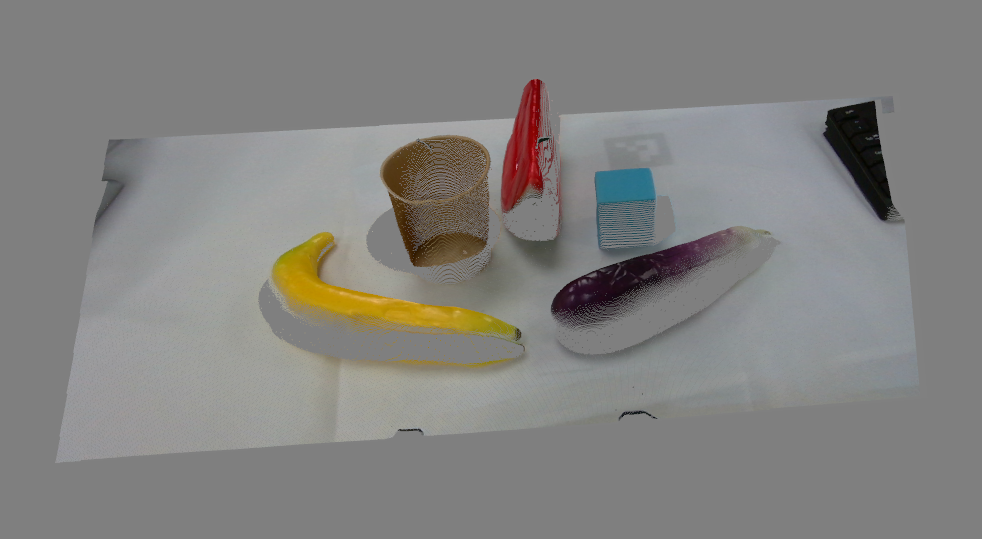
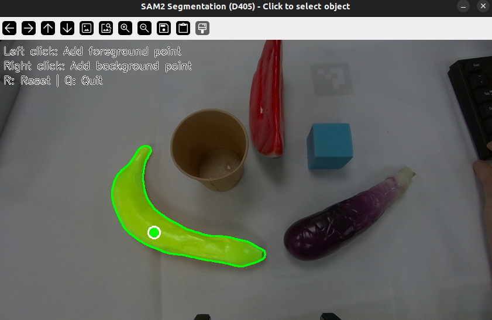
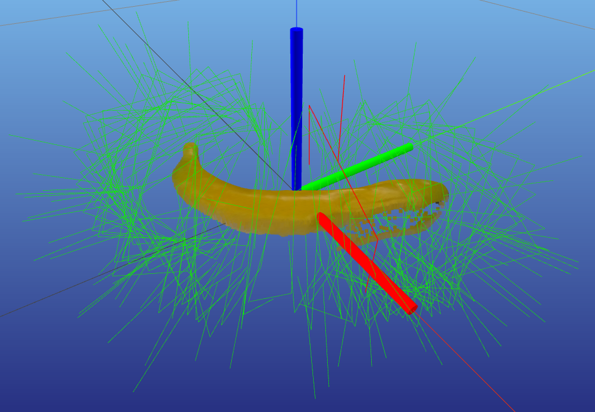

# 6D 抓取

基于 Intel RealSense D405 和 Orbbec Gemini 335 双目相机的 6D 抓取位姿生成与执行系统。

## 配置

### 获取源码

在 ``alicia_d_grasp_6d/Models`` 目录下：
```bash
git clone https://github.com/NVlabs/GraspGen.git
git clone https://github.com/NVlabs/FoundationStereo.git
git clone https://github.com/facebookresearch/sam2.git
```
相应地，您需要创建三个conda虚拟环境，建议命名 ``GraspGen``, ``foundation_stereo``, ``sam2``。虚拟环境的创建和配置须参考官方文档：

[GraspGen](https://github.com/NVlabs/GraspGen)

[FoundationStereo](https://github.com/NVlabs/FoundationStereo)

[SAM2](https://github.com/facebookresearch/sam2)

您需要根据官方文档进行配置，建议使用教程中的"pip installation"而非docker。您需要根据文档下载官方权重，并跑通文档中推理部分的demo。


## 启动顺序

### 1. 启动机械臂和相机

```bash
ros2 launch alicia_d_moveit real_robot.launch.py
```

若使用 Realsense D405 相机（推荐）：

```bash
ros2 launch realsense2_camera rs_launch.py \
    enable_infra1:=true \
    enable_infra2:=true \
    infra_rgb:=true \
    pointcloud.enable:=true
```

若使用 Gemini 335 相机：
```bash
ros2 launch orbbec_camera gemini_330_series.launch.py \
    enable_left_ir:=true \
    enable_right_ir:=true \
    enable_point_cloud:=true \
    enable_colored_point_cloud:=true
```

> 推荐使用 Intel Realsense D405 相机，在本6D抓取代码中，使用该型号相机支持彩色点云。使用Orbbec Gemini 335 相机暂不支持彩色点云，如有需要，可自行修改相关代码。
> 
> 以下内容均以 Intel Realsense D405 相机为例，若使用 Orbbec Gemini 335 相机，请相应修改文件路径和文件名。

### 2. 启动 ROS 桥接节点

```bash
# 系统 Python 环境
python3 d405_ros_bridge.py
```

### 3. 启动 MeshCat 可视化服务器

```bash
# graspgen 环境
conda activate GraspGen
meshcat-server
```
在浏览器中打开输出链接。

### 4. 启动抓取执行节点

```bash
# 系统 Python 环境（退出conda）
python3 d405_execution.py
```

**交互操作**:
- `y`：执行当前抓取
- `n`：跳过，查看下一个
- `q`：退出

### 5. 启动深度估计节点（FoundationStereo）

```bash
# FoundationStereo 环境
conda activate foundation_stereo
python d405_foundationstereo.py --visualize
```

**参数**:
- `--ckpt_dir`: 模型权重路径
- `--scale`: 图像缩放比例
- `--z_near`: 最小深度阈值（D405 近距离场景建议保持 `0.01`）
- `--z_far`: 最大深度
- `--denoise_cloud`: 启用点云去噪（默认开启）

> 注意：D405 是近距离相机。如果目标离镜头非常近，而点云可视化为空，通常是最小深度阈值过大导致。当前 D405 脚本已默认使用 `--z_near 0.01`，避免沿用 FoundationStereo 通用工具中的 `0.1 m` 近裁剪阈值。


<p align="center"></p>

### 6. 启动目标分割节点（SAM2）

```bash
# SAM2 环境
conda activate sam2
python d405_sam2.py
```

**参数**:
- `--model`: 模型大小 [tiny/small/base/large]（默认 large）
- `--bridge_port`: ZeroMQ 端口

**交互操作**:
- 左键点击：添加正样本点（目标区域）
- 右键点击：添加负样本点（背景区域）
- `r` 键：重置
- `q`：退出

<p align="center"></p>

### 7. 启动抓取生成节点（GraspGen）

```bash
# GraspGen 环境
conda activate GraspGen
python d405_graspgen.py
```

**参数**:
- `--gripper_config`: 夹爪配置文件
- `--grasp_threshold`: 置信度阈值（默认 0.8）
- `--num_grasps`: 生成抓取数量（默认 200）
- `--topk_num_grasps`: 返回 top-k 抓取（默认 100）

<p align="center"></p>

**交互操作**:
- ``Enter``：重新生成抓取位姿


## Gemini 335 使用流程

以下流程与 D405 一致，但脚本与启动命令切换为 Gemini 335 对应版本。

### 1. 启动机械臂和相机

```bash
ros2 launch alicia_d_moveit real_robot.launch.py
```

```bash
ros2 launch orbbec_camera gemini_330_series.launch.py \
    enable_left_ir:=true \
    enable_right_ir:=true \
    enable_point_cloud:=true \
    enable_colored_point_cloud:=true
```

### 2. 启动 ROS 桥接节点

```bash
# 系统 Python 环境
python3 gemini_ros_bridge.py
```

### 3. 启动 MeshCat 可视化服务器

```bash
# GraspGen 环境
conda activate GraspGen
meshcat-server
```
在浏览器中打开输出链接。

### 4. 启动抓取执行节点

```bash
# 系统 Python 环境（退出conda）
python3 gemini_execution.py
```

**交互操作**:
- `y`：执行当前抓取
- `n`：跳过，查看下一个
- `q`：退出

### 5. 启动深度估计节点（FoundationStereo）

```bash
# FoundationStereo 环境
conda activate foundation_stereo
python gemini_foundationstereo.py --visualize
```

**参数**:
- `--ckpt_dir`: 模型权重路径
- `--scale`: 图像缩放比例
- `--z_far`: 最大深度
- `--denoise_cloud`: 启用点云去噪（默认开启）

### 6. 启动目标分割节点（SAM2）

```bash
# SAM2 环境
conda activate sam2
python gemini_sam2.py
```

**参数**:
- `--model`: 模型大小 [tiny/small/base/large]（默认 large）
- `--bridge_port`: ZeroMQ 端口

**交互操作**:
- 左键点击：添加正样本点（目标区域）
- 右键点击：添加负样本点（背景区域）
- `r` 键：重置
- `q`：退出

### 7. 启动抓取生成节点（GraspGen）

```bash
# GraspGen 环境
conda activate GraspGen
python gemini_graspgen.py
```

**参数**:
- `--gripper_config`: 夹爪配置文件
- `--grasp_threshold`: 置信度阈值（默认 0.8）
- `--num_grasps`: 生成抓取数量（默认 200）
- `--topk_num_grasps`: 返回 top-k 抓取（默认 100）

**交互操作**:
- ``Enter``：重新生成抓取位姿


## 文件说明

| 文件 | 功能 |
|------|------|
| `d405_ros_bridge.py` | ROS 2 与 ZeroMQ 桥接，转发相机图像 |
| `d405_foundationstereo.py` | FoundationStereo 深度估计，生成点云 |
| `d405_sam2.py` | SAM2 交互式目标分割 |
| `d405_graspgen.py` | GraspGen 抓取位姿生成 |
| `d405_execution.py` | MoveIt 2 抓取执行 |
| `utils/transform_utils.py` | 坐标变换工具函数 |

## 数据目录

- `.bridge_data/`: 节点间数据交换目录
- `outputs/`: 输出文件（点云、深度图等）
